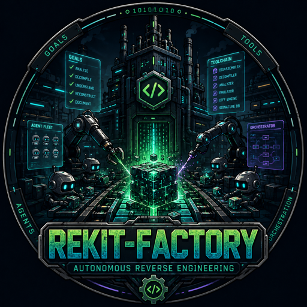

<div align="center">
  
</div>

# rekit-factory

Rekit Factory is a dark factory for reverse engineering and software research.
Give it a target, a goal, a set of tools, and a worker/model policy; it fans the
investigation out, keeps durable track of the work, and brings consequential
decisions back to the operator.

- [Rekit](https://github.com/batteryshark/rekit) supplies and safely dispatches
  reverse-engineering tools.
- [Muster](https://github.com/batteryshark/muster) supplies the durable work queue,
  run ledger, dependency graph, coverage gate, and resume machinery.
- Factory supplies investigation workers, model/provider configuration, permission
  policy, event logging, and the Mission Control operator surface.

Factory has no predefined workflow catalog. The primary interface is always an
ad-hoc investigation: **target + goal + tools + workers**.

## First vertical slice

The current control-plane slice can:

- create a content-addressed Muster project and durable run;
- enqueue Rekit tool calls and multiple model workers;
- drain independent workers concurrently without double-leasing work;
- stream worker status, logs, model metadata, and tool outcomes into SQLite;
- suspend a gated tool call as a durable permission question;
- record allow/deny, re-queue the blocked call, and resume;
- expose a JSON snapshot shaped for the Mission Control mockup.

```sh
# Load credentials without printing them, then start a benign investigation.
set -a
source ~/Projects/secrets.env
set +a

PYTHONPATH=src:~/Projects/muster/src \
  ~/Projects/muster/.venv/bin/python -m rekit_factory start \
  rekit-demo/atlassian-mcp-server \
  --goal "Map the request surface and identify the highest-risk behavior." \
  --tool secrets-scan \
  --worker recon --worker analyst \
  --model-env MINIMAX
```

The command prints the run directory. Inspect or resume it with:

```sh
python -m rekit_factory status <run-dir>
python -m rekit_factory resume <run-dir> --model-env MINIMAX
python -m rekit_factory answer <run-dir> <question-id> allow --model-env MINIMAX
```

Mission Control can use the loopback API and resumable event stream:

```sh
rekit-factory --storage-root ~/.rekit-factory serve --model-env MINIMAX
```

Repeat `--model-env` to register more profiles, then select one per run with
`--model-profile` or the Mission Control composer:

```sh
rekit-factory serve --model-env MINIMAX --model-env LMSTUDIO
rekit-factory start ./target --goal "Trace the license decision" \
  --model-env MINIMAX --model-env LMSTUDIO --model-profile lmstudio
```

Use `--tool` for an up-front deterministic Rekit pass, or `--model-tool` to let a
worker request a tool through Muster. Model-requested tools are never called directly:
they become durable work items, and safety-gated tools pause for operator permission.

```sh
rekit-factory start ./target --goal "Find the verification boundary" \
  --model-env MINIMAX --model-tool strings-extract --model-tool exec-observe
```

Profiles use the OpenAI-compatible protocol by default. Set `<PREFIX>_API_FORMAT`
to `anthropic` for Anthropic-compatible endpoints; the same profile selector works
for either protocol:

```sh
export MINIMAX_API_FORMAT=anthropic
export MINIMAX_API_BASEURL=https://api.minimax.io/anthropic
export MINIMAX_API_MODEL=MiniMax-M2.7
rekit-factory serve --model-env MINIMAX
```

`<PREFIX>_API_KEY` is read only when the server starts and is never written to a
run, event, or model-call record.

Anthropic-compatible workers preserve their Pydantic message history (including
thinking/tool parts and provider signatures) in the per-run ledger. Semantic model
events and coalesced 512-character streaming checkpoints flow through the existing
resumable SSE endpoint. Model-requested Rekit calls are external/deferred operations:
the worker stops, Muster executes or gates the tool, and a later process can resume the
same worker with the durable result.

Prompt caching is explicit for normal and continuation turns. The initial forced-tool
turn disables cache breakpoints because MiniMax-M3 currently ignores forced tool choice
when `cache_control` blocks are present; caching is restored automatically once the tool
result is returned.

Open `http://127.0.0.1:8768/` for the live Mission Control page.

The initial endpoints are `GET /api/fleet`, `GET /api/runs/<id>`,
`GET /api/runs/<id>/events` (SSE), `POST /api/runs`,
`POST /api/runs/<id>/answers`, and `POST /api/runs/<id>/resume`.

## Layout

| Path | Purpose |
| --- | --- |
| [`src/rekit_factory/control.py`](src/rekit_factory/control.py) | Run creation, concurrent drain, permission suspension, and resume |
| [`src/rekit_factory/store.py`](src/rekit_factory/store.py) | Factory tables layered onto the Muster ledger |
| [`src/rekit_factory/models.py`](src/rekit_factory/models.py) | Named OpenAI-compatible model profiles and bounded workers |
| [`src/rekit_factory/rekit_client.py`](src/rekit_factory/rekit_client.py) | Rekit manifest and execution adapter |
| [`src/rekit_factory/api.py`](src/rekit_factory/api.py) | Loopback JSON API, SSE logs, and background drive supervisor |
| [`src/rekit_factory/ui/index.html`](src/rekit_factory/ui/index.html) | Live Mission Control fleet, inbox, composer, and run detail |
| [`docs/architecture.md`](docs/architecture.md) | Ownership and control-plane contract |
| [`docs/remote-workers.md`](docs/remote-workers.md) | VM/container worker protocol and Windows isolation plan |
| [`docs/mockups/`](docs/mockups/) | Mission Control visual design references |
| [`.work/`](.work/) | Live backlog and captured ideas |

## Develop

```sh
PYTHONPATH=src:~/Projects/muster/src \
  ~/Projects/muster/.venv/bin/python -m pytest tests/test_control_plane.py -q
```

The deterministic tests do not use a network or API key. The real-model smoke test
is opt-in and uses `MINIMAX_API_KEY`, `MINIMAX_API_BASEURL`, and
`MINIMAX_API_MODEL` from the process environment.

## License

Apache-2.0.
