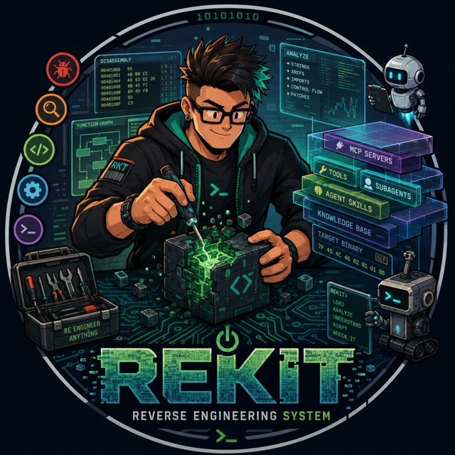

<div align="center">
  
</div>

# rekit — Reverse Engineering System

**A harness-agnostic reverse-engineering runtime.** Point it at a target, pick a
goal, and agents work it: **load · analyze · understand · adapt · wreck it.**

rekit is the kernel: the ralph loop, the persistent project **ledger**, discovery
and artifact tracking, skill loading/scoping, the human channel, and goalpacks
(goals you run against a target).

## Scope

- **Runtime only.** rekit orchestrates; it does not understand code. Parsers,
  decompilers, and tree-sitter live inside *skills*, never here.
- **Harness-agnostic.** pi / claude / codex / opencode are pluggable brains
  behind one thin adapter seam (`invoke(...) -> actions`). Swap the brain without
  touching goalpacks or skills.
- **Depends on nothing.** rekit is a clean kernel with zero runtime
  dependencies; heavy deps live inside the skills that need them.

## Layout

Subpackages mirror the architecture (the Epic column records which epic built each):

| Package         | Intent                                                              | Epic |
| --------------- | ------------------------------------------------------------------- | ---- |
| `rekit/ledger`  | Persistent project ledger (file protocol under `$REKIT_HOME/projects/<id>`) | E1 |
| `rekit/loop`    | The ralph loop that drives the harness against the ledger           | E2   |
| `rekit/harness` | Harness adapters — `invoke(brain, prompt, tools, ledger_context, tier)` (pi first) | E2 |
| `rekit/skills`  | Filesystem skill discovery, scoping, and a searchable registry      | E3   |
| `rekit/human`   | `ask_human` / `present_choices` channel                             | E4   |
| `rekit/cli.py`  | Minimal CLI entry point (`rekit`)                                   | E0   |

## Develop

The workspace uses [uv](https://docs.astral.sh/uv/):

```sh
uv venv
uv pip install -e .
.venv/bin/python tests/test_smoke.py    # plain-python runner
# or: .venv/bin/python -m pytest        # pytest-compatible
rekit --version
```

## Status

Built and running: persistent ledger, skills + scoping, human channel, the
harness adapter (real pi), the ralph loop with sandboxed skill execution and
fan-out, and goalpacks.
